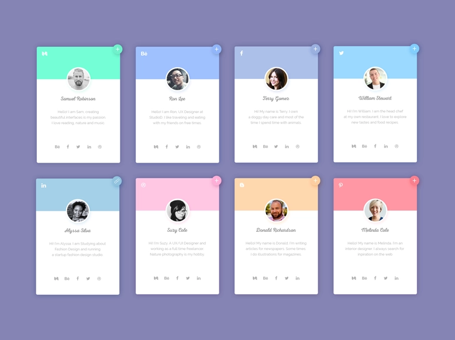

# T334-JS_intro

## -------INFO
```

1. Intro
2. Syntax
3. Types
4. Flow control
5. Functions
6. Objects
7. DOM

```


```html
...............

        <input id="btnprev" type="button" value="<">

        

        <input id="btnnext" type="button" value=">">

        <script>
            const btnprev = document.getElementById('btnprev');
            const btnnext = document.getElementById('btnnext');
            const img = document.getElementById('myimg');

            let counter = 0;

            const obrazki = [
                'https://images.pexels.com/photos/5725972/pexels-photo-5725972.jpeg?auto=compress&cs=tinysrgb&h=650&w=940',
                'https://images.pexels.com/photos/10069506/pexels-photo-10069506.jpeg?auto=compress&cs=tinysrgb&h=650&w=940',
                'https://images.pexels.com/photos/7997389/pexels-photo-7997389.jpeg?auto=compress&cs=tinysrgb&h=650&w=940',
                'https://images.pexels.com/photos/10314318/pexels-photo-10314318.jpeg?auto=compress&cs=tinysrgb&h=650&w=940'
            ];

            //const obrazki1 = [];
            //const obrazki2 = new Array();

            btnprev.addEventListener('click',function (){zmien('prev')});
            btnnext.addEventListener('click',() => zmien('next'));

            function zmien(jak){
                if(jak == 'prev'){
                    console.log('poprzedni',counter,obrazki[counter])
                    if(counter > 0){
                        counter--;
                    } else {
                        counter = obrazki.length -1;
                    }
                    //conter = counter - 1
                } else {
                    console.log('nastepny',obrazki.length,counter,obrazki[counter])
                    if(counter < obrazki.length - 1){
                        counter++;
                    } else {
                        counter = 0;
                    }
                    //conter = counter + 1
                }                    
                img.src = obrazki[counter];
            }
        </script>
          
................
```

```javascript
        const container = document.createElement('div')
        document.body.appendChild(container);

        function dodaj(){
            const newDiv = document.createElement('div')
            newDiv.id = "nowyDiv";
            newDiv.classList.add('czerwony')
            newDiv.style.border = '1px solid'
            newDiv.innerHTML = content;

            container.appendChild(newDiv);
        }
```

```
ZADT30601
T33401 - Przygotuj sterowanie kwadratowym elementem z uzyciem buttonów (arrows).

T33402 - Przygotuj skrypt wstawiający po kliknięciu cegłę do kontenera. Cegły buduja mur. 
Mur buduje się od dolnej krawędzi strony i może być wyższy niz strona.
- dodaj teksturę do cegieł (gradient/pattern)
- upewnij się że cegły budują się prawidłowo (na zakładkę)
- losuj odcień cegieł (każda ma inny odcień)
- zanimuj spadanie cegieł z góry podczas budowania

T33403 - Przygotuj stronę html wyświetlającą karty profilowe z danymi pobranymi z tablicy. 
(Zastosuj css do sformatowania zgodnie z rysunkiem - Rys 1.)

T334004 - Przygotuj zegar z obręczami zamiast wskazówek wskazujący rzeczywisty czas. (Canvas)
 Zastosuj Koła o odpowiednio pbliczonym zakresie zgodnie z rys 2)

T334004 - Sprawdzian z podstaw Java script (zmienne, instr. warunkowe, pętle, tablice) DATA: 10.05.2022
```




### --------Links
https://github.com/T3iL/T303-CSS

GOOGLE DRIVE: https://drive.google.com/drive/folders/1OqTcjwr_qAdTPO-dThxUOd3ooTTOlzgp?usp=sharing

https://cdnjs.cloudflare.com/ajax/libs/font-awesome/4.7.0/css/font-awesome.min.css

https://www.w3.org | https://validator.w3.org | https://www.php.net/manual/en/
### --------Repositiories
https://www.w3schools.com | https://stackoverflow.com | https://css-tricks.com |
### --------On line editors
https://codepen.io/ | https://codesandbox.io/ | https://jsfiddle.net/ |
### ---------Assets
https://cdnjs.com/ | https://fontawesome.com | http://fontello.com/ | https://fonts.google.com/ | https://www.flaticon.com/
### ---------Stock Img
https://www.pexels.com/ | https://unsplash.com | https://pixabay.com
### ---------Tuts
https://www.youtube.com/watch?v=OcwON22ctYc
https://www.youtube.com/watch?v=udxqsJXJM5Q
https://www.youtube.com/c/helloroman
### ---------License
[MIT](https://choosealicense.com/licenses/mit/)
